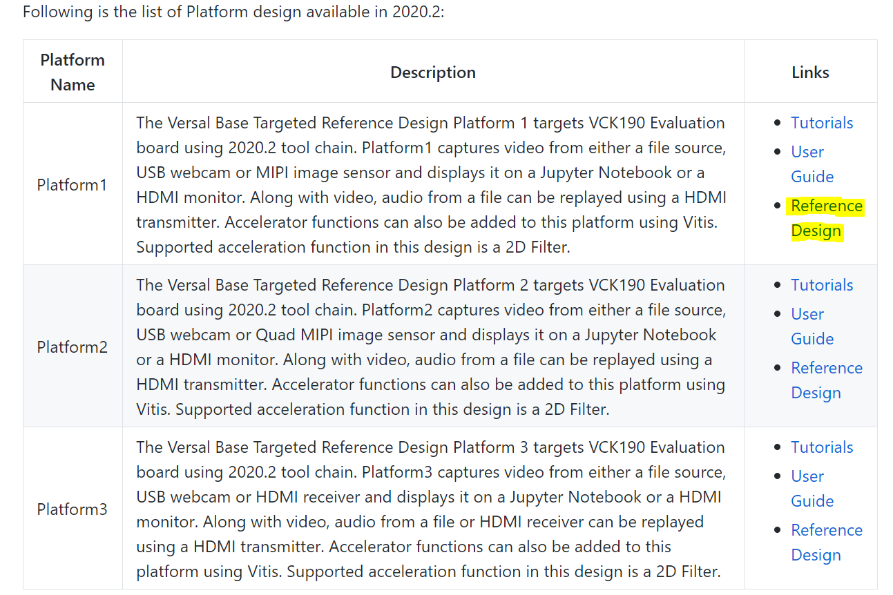
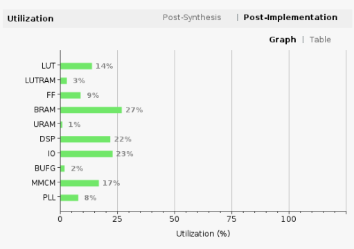
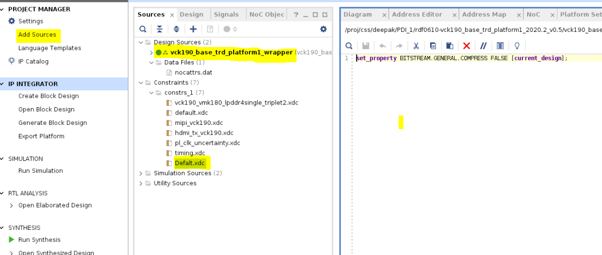
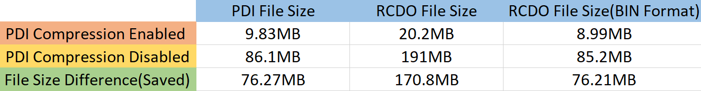

# Versal Example Design: PDI Compression

## **Introduction**

Versal PDI images can be generated with the Vivado compress setting. The compression of the PDI image will typically provide mild compression resulting in a smaller file size. The smaller file size may allow a lower density flash to be selected or free memory to store extra data. The percentage of compression from the original PDI file size is dependent on the design place and route results and may vary from one implementation to the next.                    

### **Note: For Versal, PDI Compression is enabled by default.**

## **Design Summary**

This Versal example design will demonstrate how to generate a compressed and uncompressed PDI for the VCK190. The PDI results show the benefit for compression on the PL-CFI partition.  With this knowledge users can review their design compression percentage.                                                                                       
The example VCK190 flow uses the QSPI boot mode, but the compress/uncompress setting is the same and independent of which boot mode is selected.                             

---

## **Required Hardware and Tools**

2020.2 Vivado and Vitis : https://www.xilinx.com/support/download/index.html/content/xilinx/en/downloadNav/vivado-design-tools/2020-2.html

Versal VCK190 Evaluation Platform (pre-production)

Boot module: X-EBM-01 (Dual Parallel QSPI) Rev_A01

Download Platform 1 TRD Design : https://github.com/Xilinx/vck190-base-trd

---

## **Vivado Hardware Design Build Instructions**
### **Steps for TRD Design Run**
#### **1.**
Go to https://github.com/Xilinx/vck190-base-trd and download the Reference Design ZIP File as shown below.                                                                

#### **2.**
Unzip the Reference Design ZIP File in your $working_dir.
### PDI Creation with compression enabled (Default).

#### **1. Open Vivado by navigating to Start > Xilinx Design Tools > Vivado 2020.2.**

##### **On Windows:**
    In the Vivado tcl console type:
    
    cd $working_dir/vivado
    source scripts/main.tcl
    
##### **On Linux:**
    At the command prompt enter:

    cd $working_dir/vivado
    vivado -source scripts/main.tcl

#### **2. A Vivado cockpit as shown below will open with vck190_base_trd_platform1 project populated.**


#### **3. In the Flow Navigator pane on the left-hand, click on Open Block Design. An IP Integrator (IPI) block design (vck190_base_trd_platform1.bd) becomes visible that contains the Control, Interface and Processing System (CIPS) IP, NOC IP, AXI Performance Monitors (APM), MIPI CSI capture pipeline and HDMI Tx display pipeline. This highlights the example design components used. Next, in the Flow Navigator pane on the left-hand side under Program and Debug, click on Generate Device Image. The programmable device image (PDI) will be created for the Versal ACAP.**


#### **4. Once the PDI image is generated, refer to PDI image file size present in $working_dir\rdf0610vck190_base_trd_platform1_2020.2_v0.5\vck190_base_trd_platform1_2020.2_v0.5\vivado\project\vck190_base_trd_platform1.runs\impl_1 folder**

### Observations on compressed PDI
    
#### **1.** 
In the impl_1 folder, refer vck190_base_trd_platform1_wrapper_utilization_placed.rpt. The report shows the design utilization (refer below image). From this we can observe the logic elements utilized inside FPGA by this example design.                                         

     

#### **2.** 
Under the impl_1 folder you will see the PL-CFI RCDO (vck190_base_trd_platform1_wrapper.rcdo) is 20.2MB. In impl_1 folder resulting PDI File size of vck190_base_trd_platform1_wrapper.pdi is 9.83MB.                                                                      
#### **3.** 
With the compress option enabled the PDI resulting output file sizes are reduced compared to the file size with the compress setting disabled, shown next.                                                                            
### PDI Creation without compression enabled (Uncompressed).
##### Note : Rename or save the PDI, RCDO, and vck190_base_trd_platform1_wrapper_utilization_placed.rpt files to another folder, so that they are not overwritten when you create the the PDI uncompressed files.
#### **1. In the current project add this constraint :**
 ```
 set_property BITSTREAM.GENERAL.COMPRESS FALSE [current_design] to top design as below image.
 ```



#### **2. Click on generate device image.**

#### Observations on uncompressed PDI
#### **1.** 
Using the same design, see vck190_base_trd_platform1_wrapper_utilization_placed.rpt, but with the compress setting disabled the output file size has increased.      
#### **2.** 
For this example run, the resulting PDI File vck190_base_trd_platform1_wrapper.pdi is 86.1MB and in impl_1 folder the vck190_base_trd_platform1_wrapper.rcdo file size is 191MB.  See the table below for the result comparison:                                          
                                                                                                                 
                                                                                    

##### Note: Vivado generates the PL-CFI RCDO files in ASCII format for readability, the binary version of the PL-CFI cdo used in the PDI file can be obtained using the cdoutil command:
```
cdoutil -output-binary-be -output-file test.bin vck190_base_trd_platform1_wrapper.rcdo
```
                                                                                                                                                                            
## **Conclusion**
The compression feature in Versal is enabled by default and help reducing the PDI file size. 
This example design steps helps the customer to understand the effectiveness of PDI Compression feature.

© Copyright [2020] Xilinx, Inc. All rights reserved.

