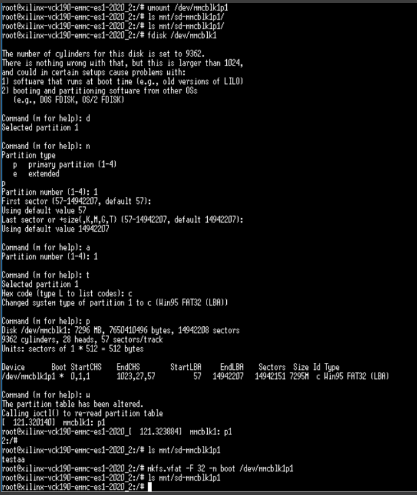
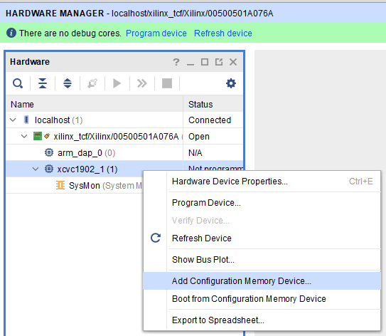
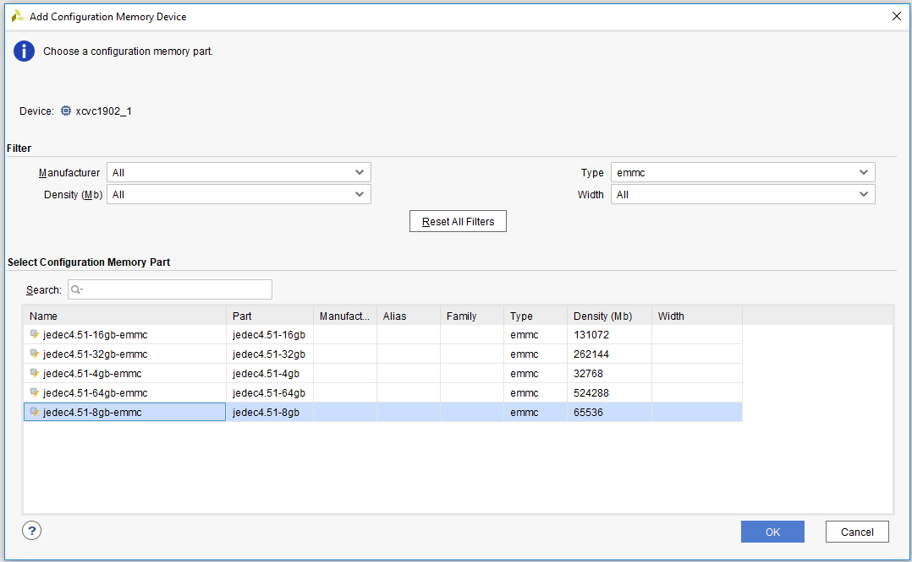
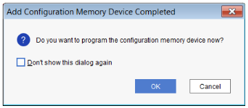
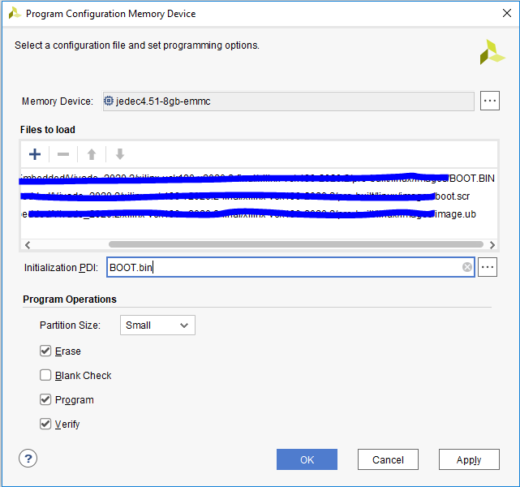

# Versal Example Design: VCK190 eMMC bring up

# Table of Contents

1. [Introduction](#introduction)

2. [Before You Begin](#before-you-begin)

3. [Project is NOT](#project-is-not)

4. [Board Setup and Considerations](#board-setup-and-considerations)

5. [Build Instructions](#build-instructions)

6. [Running the Design without using Vivado Hardware Manager](#running-the-design-without-using-vivado-hardware-manager)

7. [Running the Design using Vivado Hardware Manager](#running-the-design-using-vivado-hardware-manager)

8. [Conclusion](#conclusion)


# **Introduction**

In order to use the eMMC Boot Module on the VCK190 the flash needs to be formatted and partitioned properly.
This page guides you through the first time usage of the eMMC flash in two cases:
- without Vivado HW Manager
- with Vivado HW Manager

This page can also be followed to recover a corrupted eMMC flash that doesn't boot up to Linux.

## Directory Structure
<details>
<summary> vck190 eMMC Boot Tutorial Directory Details </summary>

```
vck190_boot_emmc
|___Hardware.................Contains Vivado design input constraints
  |___constraints...........................Contains Vivado design input constraints
|___Scripts.................Contains TCL scripts to generate reference design, PDI/XSA, XHUB board file installation script and text file with the commands to reconfigure eMMC
  |___cmd_to_reconfigure_emmc....................Contains the text file with the commands to reconfigure eMMC
    |___cmd_to_reconfigure_emmc.txt....................text file with the commands to reconfigure eMMC
  |___project_top_emmc_es1.tcl....................Create vivado project for eMMC
  |___project_top_sd1_es1.tcl.....................Create vivado project for SD card
  |___vck190_board_install.tcl...................Install board file for vck190 ES1 v1.1
  |___vck190_emmc_es1_bd.tcl......................Create block design for eMMC
  |___vck190_sd1_es1_bd.tcl..................Create block design for SD card
  |___xsa_generation_for_projects_emmc_and_sd1.tcl..............Top level scripts for eMMC and SD card vivado project, and it also run implement and write XSA for the projects
|___Software................Contains TCL scripts to generate reference design and PDI, and to read JTAG registers
  |___emmc........Directory that XSA for eMMC project will be written to
  |___sd1................Directory that XSA for SD card project will be written to
  |___user_dtsi...............Contains "system-user.dtsi" for petalinux projects
    |___system-user.dtsi.........................."system-user.dtsi" for petalinux projects
|___icons.................Contains image to format eMMC partitions in linux
  |___fdisk_commands.PNG...........................Image to format eMMC partitions in linux
  |___boot_modes_switch.PNG........................Image to select the boot modes switch
  |___add_config.PNG...............................Image to add configuration memory device
  |___config_mem.PNG...............................Image to add configuration memory device
  |___config_mem_ok.PNG............................Image to program memory device
  |___prog_mem.PNG.................................Image to program memory device
|___README.md...............Includes tutorial overview, steps to create reference design, and instructions to run the design
```
</details>

---

# Before You Begin

Recommended general knowledge of:
* VCK190 evaluation board
* Versal primary boot mode
* Versal PMC/PS peripherals
* Xilinx Vivado Design Suite  

<details>

<summary> Key Versal Reference Documents </summary>

* VCK190 Evaluation Board User Guide [(UG1366)](https://www.xilinx.com/support/documentation/boards_and_kits/vck190/ug1366-vck190-eval-bd.pdf)
* Versal Technical Reference Manual [(AM011)](https://www.xilinx.com/support/documentation/architecture-manuals/am011-versal-acap-trm.pdf)
* Versal System Software Developers User Guide [(UG1304)](https://www.xilinx.com/support/documentation/sw_manuals/xilinx2020_2/ug1304-versal-acap-ssdg.pdf)
* Petalinux Tools Reference Guide [(UG1144)](https://www.xilinx.com/support/documentation/sw_manuals/xilinx2020_2/ug1144-petalinux-tools-reference-guide.pdf)
* Versal Embedded Design Tutorial [(UG1305)](https://www.xilinx.com/support/documentation/sw_manuals/xilinx2020_2/ug1305-versal-embedded-tutorial.pdf)

</details>

### **Required Hardware and Tools**

2020.2 Vivado and Petalinux

VCK190 ES1

Boot Modules:
  - eMMC boot module daughter card


#### **NOTE**:
The eMMC Boot Module is currently not available for customers but the steps highlighted in this example can be easily adopted for a custom board with eMMC connected to Versal. For more information about the Boot Modules contact your Xilinx representative or file a Service Request.

---

# **Project is NOT**

 - Focused on eMMC performance
 - Show case for various possible partitioning of the flash (Only ONE, FAT32 partition is present)

---

# **Board Setup and Considerations**

eMMC boot module is attached to vck190 board with FMC slot(J212), and the eMMC device connects with PMC MIO 0~11 through this FMC slot. 
That means QSPI should be disabled and only the SD1 controller can be used in vivado project either for SD or eMMC (but not at the same time).
We need boot from sd card and re-initialize SD1 controller and PMC MIO to eMMC configuration. 

On the approach using Vivado Hardware Manager, only a specific design for eMMC is needed.

Without using Vivado HW Manager, we need create two vivado projects for SD boot and eMMC boot.

#### **NOTE**:
This examples uses lpddr4 memory available on the VCK190 board.
   
---

# **Build Instructions**

### **Vivado:**

Be sure to source `settings.sh` for Vivado. 

Run the following from the command line, it will create sd1 project and emmc project and export xsa to `Software/sd1` and `Software/emmc`:

`vivado -source xsa_generation_for_projects_emmc_and_sd1.tcl`

#### **NOTE**:

This tutorial is based on vck190 es1 board. The board file for vck190 es1 is not available in the Vivado 2020.2, so it must be installed following these steps. 
Enter the `Scripts` directory. From the command line run the following:

`vivado -source vck190_board_install.tcl`

---

### **Petalinux**:

Enter the `Software/sd1` directory. Here the Petalinux steps to create the SW components ("BOOT.BIN", "boot.scr" and "image.ub") for SD1:

`petalinux-create -t project --template versal --name plnx_vck190_sd1`

`cd plnx_vck190_sd1/`

`petalinux-create --get-hw-description=/<directory-to-sd-boot-xsa>`

To enable ethernet, need to add phy node in device tree by replacing the "system-user.dtsi" in petalinux project.

`cp ../../../user_dtsi/system-user.dtsi ./project-spec/meta-user/recipes-bsp/device-tree/files/system-user.dtsi` 

`petalinux-build`

`petalinux-package --boot --uboot`
  
Enter the `Software/emmc` directory, and the SW components ("BOOT.BIN", "boot.scr" and "image.ub") for eMMC:

`petalinux-create -t project --template versal --name plnx_vck190_emmc`

`cd plnx_vck190_emmc/`

`petalinux-create --get-hw-description=/<directory-to-emmc-boot-xsa>`

To enable ethernet, need to add phy node in device tree by replacing the "system-user.dtsi" in petalinux project.

`cp ../../../user_dtsi/system-user.dtsi ./project-spec/meta-user/recipes-bsp/device-tree/files/system-user.dtsi` 

`petalinux-build`

`petalinux-package --boot --uboot`

# **Running the Design without using Vivado Hardware Manager**

Here is brief list of steps to initialize eMMC after booting from SD card.

### **Boot u-boot from SD card:**

Step #1. Open the UART Console for the Versal device

Step #2. Copy the "BOOT.BIN" for sd boot to sd card, Copy the "image.ub" for emmc boot to sd card. Boot in sd mode (SW1[1:4]=1110, which sets pins MODE[0:3]=1110). 

### **Load "image.ub" for eMMC boot to ddr memory from the u-boot console:**

Step #3. Run below command in u-boot console.

`fatload mmc ${devnum}:${distro_bootpart} 0x10000000 image.ub`

### **Re-initialize SD1 controller and PMC MIO 0~11 for eMMC using the commands in emmc_pmc_reconfig.txt from the u-boot console:**

Step #4. Copy the commands in `Scripts/cmd_to_reconfigure_emmc/emmc_pmc_reconfig.txt` to u-boot console, and run them all.

#### **NOTE:**
The commands in "emmc_pmc_reconfig.txt" are generated by compare the register differece between "pmc_data.cdo" files for sd boot and emmc boot.

### **Boot the "image.ub" specific for eMMC boot:**

Step #5. Run below command in u-boot console, and it will boot linux.

`bootm 0x10000000` 

### **Format the eMMC device with partition, from the Linux console:**

Step #6. In linux console, re-format and re-partition the eMMC to its max capacity

Be sure to unmount the eMMC before using fdisk.



### **copy eMMC boot images from host with tftp to eMMC partition:**

Step #7. Setup tftpd server in host, and configure IP with ifconfig in linux on the board.

         - setup IP address for GEM0, `ifconfig eth0 192.168.1.10`
         
         - connect ethernet cable between RJ45 slot J307(upper) and host, setup IP address '192.168.1.100' in host, test ping
         
         - setup tftp server in host, and set tftp server folder to directory of eMMC boot images

Step #8. Copy the boot images for emmc boot from tftpd server to eMMC partition.

         - `root@xilinx-vck190-emmc-es1-2020_2:/mnt/sd-mmcblk1p1# tftp -g 192.168.1.100 -r BOOT.BIN`
         
         - `root@xilinx-vck190-emmc-es1-2020_2:/mnt/sd-mmcblk1p1# tftp -g 192.168.1.100 -r boot.scr`
         
         - `root@xilinx-vck190-emmc-es1-2020_2:/mnt/sd-mmcblk1p1# tftp -g 192.168.1.100 -r image.ub`

Step #9. Umount the eMMC partition, and power off the board.


### **Power again to boot from eMMC:**

Step #10. After changing the boot mode pins to eMMC (SW1[1:4]=0110, which sets pins MODE[0:3]=0110), power on the board.

         - After linux boot, you can see below linux prompt which indicates this is eMMC image.
           
           root@xilinx-vck190-emmc-es1-2020_2:/mnt/sd-mmcblk1p1#


# **Running the Design using Vivado Hardware Manager**

Here is brief list of steps to initialize eMMC using Vivado HW Manager.
For additional details refer to UG980 “Programming and Debugging”. There a chapter dedicated to “Programming Configuration Memory Devices”.

Step #1.	Before you begin, ensure the SW13 power switch is off.

Step #2.	Connect the power cable to the VCK190 J16.

Step #3.	Connect the USB-C cable used for JTAG/UART from your host system (where Vivado is installed) to VCK190 J207.

Step #4.	Set the Versal ACAP to JTAG Boot Mode SW1[1:4]=0000 (which sets pins MODE[0:3]=0000) (All Up).


 
Step #5.	Set SW13 to the ON position.

Step #6.	Check that the power good (PG) LEDs are all on, except the VCC_RAM PG LED is off and reserved LEDs (reserved LEDs can be on or off).

Step #7.	Open the 2020.2 Vivado Hardware Manager.

Step #8.	Select Open New Target and connect the VCK190.

Step #9.	Right-click Versal device xcvc1902_1 and select Add Configuration Memory Device



Step #10.	configuration memory part and click OK. The configuration memory device is now added to the hardware target device.



Step #11.	After creating the configuration memory device, Vivado device programmer prompts "Do you want to program the configuration memory device now?" as shown below.



Step #12.	Click OK to open the Program Configuration Memory Device dialog box. Populate the "Files to load" with the SW components ("BOOT.BIN", "boot.scr" and "image.ub") for eMMC. Use the same BOOT.bin for eMMC as "Initialization PDI" as shown in the figure below.



Step #13.	Click Apply and OK.

Step #14.	Wait for the programming to finish.

Step #15.	After changing the boot mode pins to eMMC (SW1[1:4]=0110 - which sets pins MODE[0:3]=0110), power on the board.

# **Conclusion**
Many steps of this example can be used to bringup the eMMC on VCK190 or any custom board. The user can also come up with his own flow if various multiple partititons are needed.

© Copyright [2020] Xilinx, Inc. All rights reserved.
