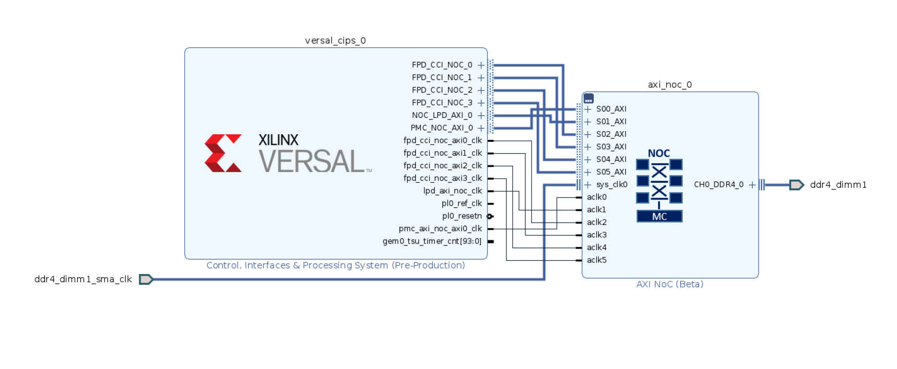
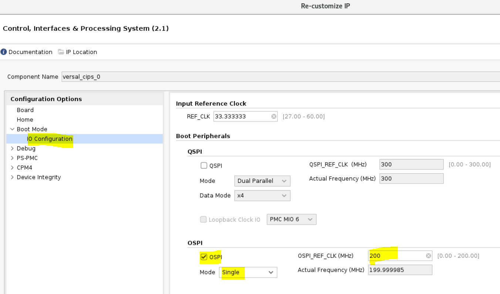

# Versal Example Design: OSPI boot on vck190

## **Introduction**

The octal SPI (OSPI) boot mode has an SPI compatible serial bus interface with extended octal commands. Standard Serial Peripheral Interface (SPI) is supported along with high performance Octal SPI variants. The OSPI boot mode supports an 8-bit data bus width and single transfer rate (STR) during the RCU BootROM execution. The Octal-SPI Flash Controller transfer the data either in a memory mapped direct fashion or in an indirect fashion where the controller is set up via configuration registers to silently perform some requested operation, signalling its completion via interrupts or status registers. For indirect operations, data is transferred between system memory and external FLASH memory via an internal SRAM. OSPI has it’s own internal DMA which is used to read the data from the flash, SRAM is accessible only in case of DMA mode of operation (indirect mode). For additional information, see Octal SPI controller in [AM011](https://www.xilinx.com/support/documentation/architecture-manuals/am011-versal-acap-trm.pdf).

## **Design Summary**

This versal example design would demonstrate how to build design for OSPI boot mode on VCK190. This will also show simple/quick steps on how to create a boot image, programming the flash for OSPI boot on this vck190 platform.

---

## **Required Hardware and Tools**

2020.2 Vivado and Vitis

Versal VCK190 Evaluation Platform

Boot module: X-EBM-03 (OSPI)

#### **NOTE**:
The Boot Module is currently not available for customers but the steps highlighted in this example can be easily adopted  for a custom board with OSPI connected to Versal. For more information about the Boot Modules contact your Xilinx representative or file a Service Request.

---

## **Block Diagram**





---

## **Build Instructions**

### **Vivado:**

Be sure to source `settings.sh` for Vivado. 

If the board under test is not present in the Vivado installation, it can be installed following these steps.

To create the project, run the following from the command line:

`vivado -source project_top.tcl`

The Vivado project will be built in the `Hardware` directory.

Once the project is created, click on "Generate Device Image".

Wait until "Device Image Generation successfully completed" then "Open Implemented Design".
Exporting the XSA to the Software folder with the following TCL command:
```
write_hw_platform -fixed -include_bit -force -file ../Software/vck190_wrapper.xsa
```

#### **NOTE**:
If the board under test is not present in the Vivado installation, it can be installed following these steps.

Enter the `Scripts` directory. From the command line run the following:

`vivado -source vck190_board_install.tcl`

### **Vitis**:

Be sure to source `settings.sh` for Vitis. 

Enter the `Scripts` directory. From the command line run the following:

`xsct -eval source vck190_vitis.tcl`

The Vitis project will be built in the `Software/Vitis` directory.

#### **SW Application modification**:
In helloworld.c (../Software/Vitis/hello_a72_0/src), add a delay to avoid application prints collide with the PLM prints.

```
 sleep(1);
 print("Hello World\n\r");
 print("Successfully ran Hello World application from OSPI.");
 ```
 Be sure to re-build the Hello world application after the changes are applied.

#### **Generate a Boot Image (PDI)**:
Generate a Boot Image (PDI) using the following bootgen command and the output.bif already present in the `Software/Vitis/bootimage` folder:
```
bootgen -arch versal -image output.bif -o BOOT.PDI -w
```

## **Running the Design**
#### **NOTE**:
Find vck190_wrapper.pdi in vivado project build directory and name it `vck190_ospi_prog.pdi` and use it in the flash programming steps below to make it faster.

Execute the following command on XSCT in order to program the BOOT.PDI file into OSPI flash. Xilinx strongly recommend to boot the Versal Device in JTAG boot mode (SW1 = 0000 (all ON)) to reliably program the OSPI.
```
xsct% program_flash -f BOOT.PDI -pdi vck190_ospi_prog.pdi -offset 0x0 -flash_type ospi-x8-single
```
#### **Flash programming log**:
```
xsdb% program_flash -f BOOT.PDI -pdi design_1_wrapper.pdi -offset 0x0 -flash_type ospi-x8-single
WARNING: [Common 17-259] Unknown Tcl command 'program_flash -f BOOT.PDI -pdi vck190_ospi_prog.pdi -offset 0x0 -flash_type ospi-x8-single' sending command to the OS shell for execution. It is recommended to use 'exec' to send the command to the OS shell.
                                                                                
****** Xilinx Program Flash                                                     
****** Program Flash v2020.3 (64-bit)
  **** SW Build (by xbuild) on 2021-02-02-21:46:32
    ** Copyright 1986-2020 Xilinx, Inc. All Rights Reserved.

                                                                                
Connected to hw_server @ TCP:XXXXXX:XXX
Available targets and devices:                                                  
Target 0 : jsn-VC-P-XXXX XXXXXXXXXXXXXXX
	Device 0: jsn-VC-P-XXXX XXXXXXXXXXXXXXX
Retrieving Flash info...
                                                                                
Initialization done, programming the memory
Using default mini u-boot image file - ../data/xicom/cfgmem/uboot/versal_ospi_x8_single.bin
                                                                                

U-Boot 2020.01-00031-ga604ef9 (Jan 06 2021 - 03:18:32 -0700)

Model: Xilinx Versal MINI OSPI SINGLE
DRAM:  WARNING: Initializing TCM overwrites TCM content
256 KiB
EL Level:	EL3
Versal> sf probe 0 0 0
SF: Detected mt35xu02g with page size 256 Bytes, erase size 4 KiB, total 256 MiB
Versal> Sector size = 4096.
Total size = 268435456.
f probe 0 0 0
Performing Erase Operation...
sf erase 0 189000                                                               
SF: 1609728 bytes @ 0x0 Erased: OK                                              
Versal> Erase Operation successful.
INFO: [Xicom 50-44] Elapsed time = 7 sec.                                       
Performing Program Operation...
0%...sf write FFFC0000 0 20000                                                  
device 0 offset 0x0, size 0x20000
SF: 131072 bytes @ 0x0 Written: OK                                              
Versal> sf write FFFC0000 20000 20000                                           
device 0 offset 0x20000, size 0x20000
SF: 131072 bytes @ 0x20000 Written: OK                                          
Versal> sf write FFFC0000 40000 20000                                           
device 0 offset 0x40000, size 0x20000
SF: 131072 bytes @ 0x40000 Written: OK                                          
Versal> sf write FFFC0000 60000 20000                                           
device 0 offset 0x60000, size 0x20000
SF: 131072 bytes @ 0x60000 Written: OK                                          
Versal> sf write FFFC0000 80000 20000                                           
device 0 offset 0x80000, size 0x20000
SF: 131072 bytes @ 0x80000 Written: OK                                          
Versal> sf write FFFC0000 A0000 20000                                           
device 0 offset 0xa0000, size 0x20000
SF: 131072 bytes @ 0xa0000 Written: OK                                          
Versal> 50%...sf write FFFC0000 C0000 20000                                     
device 0 offset 0xc0000, size 0x20000
SF: 131072 bytes @ 0xc0000 Written: OK                                          
Versal> sf write FFFC0000 E0000 20000                                           
device 0 offset 0xe0000, size 0x20000
SF: 131072 bytes @ 0xe0000 Written: OK                                          
Versal> sf write FFFC0000 100000 20000                                          
device 0 offset 0x100000, size 0x20000
SF: 131072 bytes @ 0x100000 Written: OK                                         
Versal> sf write FFFC0000 120000 20000                                          
device 0 offset 0x120000, size 0x20000
SF: 131072 bytes @ 0x120000 Written: OK                                         
Versal> sf write FFFC0000 140000 20000                                          
device 0 offset 0x140000, size 0x20000
SF: 131072 bytes @ 0x140000 Written: OK                                         
Versal> sf write FFFC0000 160000 20000                                          
device 0 offset 0x160000, size 0x20000
SF: 131072 bytes @ 0x160000 Written: OK                                         
Versal> 100%
sf write FFFC0000 180000 81B0                                                   
device 0 offset 0x180000, size 0x81b0
SF: 33200 bytes @ 0x180000 Written: OK                                          
Versal> Program Operation successful.
INFO: [Xicom 50-44] Elapsed time = 22 sec.

Flash Operation Successful
```

#### **Boot the Boot Image (PDI) from OSPI**:
There are two ways to test the design once the OSPI is programmed.

##### **Method #1**:
Change the Versal Device boot mode to OSPI (SW1 = 0001 (ON-ON-ON-OFF)) and power on the board.

##### **Method #2**: 
Change the Versal Device boot mode to JTAG (SW1 = 0000 (ON-N-ON-ON)), power on the board and run the following script:
```
tar -set -filter {name =~ "Versal *"}
# Enable ISO
mwr -force 0xf1120000 0xffbff
# Switch boot mode
mwr 0xf1260200 0x8100
mrd 0xf1260200
# Set MULTIBOOT address to 0
mwr -force 0xF1110004 0x0
# SYSMON_REF_CTRL is switched to NPI by user PDI so ensure its
# switched back
mwr -force 0xF1260138 0
mwr -force 0xF1260320 0x77
# Perform reset
tar -set -filter {name =~ "PMC"}
rst
```
This script change the boot mode from JTAG to OSPI without the need of power cycle the board.

#### **PLM log when booting from OSPI**:
To see the PLM Log the user can look at the UART console or use the XSDB command "plm log" from target 1 (`tar -set -filter {name =~ "Versal *"}`):

``` 
[7.123525]****************************************

[8.750406]Xilinx Versal Platform Loader and Manager 

[13.331934]Release 2020.2   Feb  9 2021  -  06:16:58

[17.915659]Platform Version: v2.0 PMC: v2.0, PS: v2.0

[22.583525]BOOTMODE: 8, MULTIBOOT: 0x0

[25.976993]****************************************

[30.496790] 24.196593 ms for PrtnNum: 1, Size: 2224 Bytes

[35.480603]-------Loading Prtn No: 0x2
[38.895021] 0.002246 ms DMA Xfr time: SrcAddr: 0x0F0254730, DestAddr: 0x0F0254AA8,156 Bytes, Flags: 0x100

[48.497587] 9.601271 ms for PrtnNum: 2, Size: 48 Bytes

[52.707900]-------Loading Prtn No: 0x3
[56.122443] 0.002246 ms DMA Xfr time: SrcAddr: 0x0F0254730, DestAddr: 0x0F0254AA8,156 Bytes, Flags: 0x100

[66.890781] 10.767043 ms for PrtnNum: 3, Size: 57168 Bytes

[70.274856]-------Loading Prtn No: 0x4
[73.689396] 0.002246 ms DMA Xfr time: SrcAddr: 0x0F0254730, DestAddr: 0x0F0254AA8,156 Bytes, Flags: 0x100

[82.854625] 9.163859 ms for PrtnNum: 4, Size: 2512 Bytes

[87.670653]-------Loading Prtn No: 0x5
[91.085118] 0.002246 ms DMA Xfr time: SrcAddr: 0x0F0254730, DestAddr: 0x0F0254AA8,156 Bytes, Flags: 0x100

[100.277918] 9.191556 ms for PrtnNum: 5, Size: 3424 Bytes

[105.152834]-------Loading Prtn No: 0x6
[108.652609] 0.002246 ms DMA Xfr time: SrcAddr: 0x0F0254730, DestAddr: 0x0F0254AA8,156 Bytes, Flags: 0x100

[117.831621] 9.177868 ms for PrtnNum: 6, Size: 80 Bytes

[122.685846]+++++++Loading Image No: 0x2, Name: pl_cfi, Id: 0x18700000

[128.746156]-------Loading Prtn No: 0x7
[132.245468] 0.002246 ms DMA Xfr time: SrcAddr: 0x0F0254730, DestAddr: 0x0F0254AA8,156 Bytes, Flags: 0x100

[141.407253] 0.001653 ms DMA Xfr time: SrcAddr: 0x0F0254748, DestAddr: 0x0F0254A80,20 Bytes, Flags: 0x100

[157.020521] 0.919393 ms DMA Xfr time: SrcAddr: 0x0F20000F0, DestAddr: 0x0F1F80000,32528 Bytes, Flags: 0x100

[164.886421] 1.290643 ms DMA Xfr time: SrcAddr: 0x0F2008100, DestAddr: 0x0F1F87F10,32768 Bytes, Flags: 0x100

[198.443562] 66.196596 ms for PrtnNum: 7, Size: 708256 Bytes

[200.920546]-------Loading Prtn No: 0x8
[204.419890] 0.002246 ms DMA Xfr time: SrcAddr: 0x0F0254730, DestAddr: 0x0F0254AA8,156 Bytes, Flags: 0x100

[213.584200] 0.001653 ms DMA Xfr time: SrcAddr: 0x0F0254748, DestAddr: 0x0F0254A80,20 Bytes, Flags: 0x100

[223.642981] 0.003093 ms DMA Xfr time: SrcAddr: 0x0F2000030, DestAddr: 0x0F60121C0,1708 Bytes, Flags: 0x100

[231.922859] 0.003093 ms DMA Xfr time: SrcAddr: 0x0F2000710, DestAddr: 0x0F60161C0,1708 Bytes, Flags: 0x100

[241.172215] 0.002337 ms DMA Xfr time: SrcAddr: 0x0F2000DE0, DestAddr: 0x0F6030100,780 Bytes, Flags: 0x100

[250.338546] 0.002337 ms DMA Xfr time: SrcAddr: 0x0F2001110, DestAddr: 0x0F6032100,780 Bytes, Flags: 0x100

[259.502109] 0.002337 ms DMA Xfr time: SrcAddr: 0x0F2001440, DestAddr: 0x0F6060100,780 Bytes, Flags: 0x100

[268.663790] 0.002337 ms DMA Xfr time: SrcAddr: 0x0F2001770, DestAddr: 0x0F6062100,780 Bytes, Flags: 0x100

[277.849193] 0.024406 ms DMA Xfr time: SrcAddr: 0x0F2001AB0, DestAddr: 0x0F6070010,25936 Bytes, Flags: 0x100

[287.191950] 0.030387 ms DMA Xfr time: SrcAddr: 0x0F2008100, DestAddr: 0x0F6076560,32768 Bytes, Flags: 0x100

[296.500406] 0.008181 ms DMA Xfr time: SrcAddr: 0x0F2000000, DestAddr: 0x0F607E560,7456 Bytes, Flags: 0x100

[305.737071] 0.002268 ms DMA Xfr time: SrcAddr: 0x0F2001D4C, DestAddr: 0x0F609001C,308 Bytes, Flags: 0x100

[314.899034] 0.001650 ms DMA Xfr time: SrcAddr: 0x0F2001EA8, DestAddr: 0x0F6090228,64 Bytes, Flags: 0x100

[323.977771] 0.001650 ms DMA Xfr time: SrcAddr: 0x0F2001F18, DestAddr: 0x0F6090428,64 Bytes, Flags: 0x100

[333.058578] 0.001650 ms DMA Xfr time: SrcAddr: 0x0F2001F88, DestAddr: 0x0F6090628,64 Bytes, Flags: 0x100

[342.143315] 0.002268 ms DMA Xfr time: SrcAddr: 0x0F200201C, DestAddr: 0x0F609101C,308 Bytes, Flags: 0x100

[351.308540] 0.001650 ms DMA Xfr time: SrcAddr: 0x0F2002178, DestAddr: 0x0F6091228,64 Bytes, Flags: 0x100

[360.393375] 0.001650 ms DMA Xfr time: SrcAddr: 0x0F20021E8, DestAddr: 0x0F6091428,64 Bytes, Flags: 0x100

[369.477750] 0.001650 ms DMA Xfr time: SrcAddr: 0x0F2002258, DestAddr: 0x0F6091628,64 Bytes, Flags: 0x100

[378.565971] 0.002268 ms DMA Xfr time: SrcAddr: 0x0F20022EC, DestAddr: 0x0F609201C,308 Bytes, Flags: 0x100

[387.732181] 0.001650 ms DMA Xfr time: SrcAddr: 0x0F2002448, DestAddr: 0x0F6092228,64 Bytes, Flags: 0x100

[396.816543] 0.001650 ms DMA Xfr time: SrcAddr: 0x0F20024B8, DestAddr: 0x0F6092428,64 Bytes, Flags: 0x100

[405.898762] 0.001650 ms DMA Xfr time: SrcAddr: 0x0F2002528, DestAddr: 0x0F6092628,64 Bytes, Flags: 0x100

[414.983850] 0.002268 ms DMA Xfr time: SrcAddr: 0x0F20025BC, DestAddr: 0x0F609301C,308 Bytes, Flags: 0x100

[424.146184] 0.001650 ms DMA Xfr time: SrcAddr: 0x0F2002718, DestAddr: 0x0F6093228,64 Bytes, Flags: 0x100

[433.226878] 0.001650 ms DMA Xfr time: SrcAddr: 0x0F2002788, DestAddr: 0x0F6093428,64 Bytes, Flags: 0x100

[442.307031] 0.001650 ms DMA Xfr time: SrcAddr: 0x0F20027F8, DestAddr: 0x0F6093628,64 Bytes, Flags: 0x100

[451.391218] 0.002268 ms DMA Xfr time: SrcAddr: 0x0F200288C, DestAddr: 0x0F609401C,308 Bytes, Flags: 0x100

[460.554531] 0.001650 ms DMA Xfr time: SrcAddr: 0x0F20029E8, DestAddr: 0x0F6094228,64 Bytes, Flags: 0x100

[469.635971] 0.001650 ms DMA Xfr time: SrcAddr: 0x0F2002A58, DestAddr: 0x0F6094428,64 Bytes, Flags: 0x100

[478.717578] 0.001650 ms DMA Xfr time: SrcAddr: 0x0F2002AC8, DestAddr: 0x0F6094628,64 Bytes, Flags: 0x100

[487.802446] 0.002268 ms DMA Xfr time: SrcAddr: 0x0F2002B5C, DestAddr: 0x0F609501C,308 Bytes, Flags: 0x100

[496.966756] 0.001650 ms DMA Xfr time: SrcAddr: 0x0F2002CB8, DestAddr: 0x0F6095228,64 Bytes, Flags: 0x100

[506.049234] 0.001650 ms DMA Xfr time: SrcAddr: 0x0F2002D28, DestAddr: 0x0F6095428,64 Bytes, Flags: 0x100

[515.129062] 0.001650 ms DMA Xfr time: SrcAddr: 0x0F2002D98, DestAddr: 0x0F6095628,64 Bytes, Flags: 0x100

[524.215787] 0.002268 ms DMA Xfr time: SrcAddr: 0x0F2002E2C, DestAddr: 0x0F609601C,308 Bytes, Flags: 0x100

[533.382093] 0.001650 ms DMA Xfr time: SrcAddr: 0x0F2002F88, DestAddr: 0x0F6096228,64 Bytes, Flags: 0x100

[542.465043] 0.001650 ms DMA Xfr time: SrcAddr: 0x0F2002FF8, DestAddr: 0x0F6096428,64 Bytes, Flags: 0x100

[551.549618] 0.001650 ms DMA Xfr time: SrcAddr: 0x0F2003068, DestAddr: 0x0F6096628,64 Bytes, Flags: 0x100

[560.636487] 0.002268 ms DMA Xfr time: SrcAddr: 0x0F20030FC, DestAddr: 0x0F609701C,308 Bytes, Flags: 0x100

[569.801321] 0.001650 ms DMA Xfr time: SrcAddr: 0x0F2003258, DestAddr: 0x0F6097228,64 Bytes, Flags: 0x100

[578.884112] 0.001650 ms DMA Xfr time: SrcAddr: 0x0F20032C8, DestAddr: 0x0F6097428,64 Bytes, Flags: 0x100

[587.965553] 0.001650 ms DMA Xfr time: SrcAddr: 0x0F2003338, DestAddr: 0x0F6097628,64 Bytes, Flags: 0x100

[597.049390] 0.002268 ms DMA Xfr time: SrcAddr: 0x0F20033CC, DestAddr: 0x0F609801C,308 Bytes, Flags: 0x100

[606.212300] 0.001650 ms DMA Xfr time: SrcAddr: 0x0F2003528, DestAddr: 0x0F6098228,64 Bytes, Flags: 0x100

[615.294759] 0.001650 ms DMA Xfr time: SrcAddr: 0x0F2003598, DestAddr: 0x0F6098428,64 Bytes, Flags: 0x100

[624.379521] 0.001993 ms DMA Xfr time: SrcAddr: 0x0F2003628, DestAddr: 0x0F6099028,172 Bytes, Flags: 0x100

[633.541293] 0.001650 ms DMA Xfr time: SrcAddr: 0x0F2003700, DestAddr: 0x0F6099810,24 Bytes, Flags: 0x100

[642.622715] 0.001650 ms DMA Xfr time: SrcAddr: 0x0F2003744, DestAddr: 0x0F609A024,92 Bytes, Flags: 0x100

[651.704934] 0.002337 ms DMA Xfr time: SrcAddr: 0x0F20037D0, DestAddr: 0x0F60A0100,780 Bytes, Flags: 0x100

[660.870412] 0.002337 ms DMA Xfr time: SrcAddr: 0x0F2003B00, DestAddr: 0x0F60A2100,780 Bytes, Flags: 0x100

[670.038137] 0.003093 ms DMA Xfr time: SrcAddr: 0x0F2003E40, DestAddr: 0x0F60F01C0,1708 Bytes, Flags: 0x100

[679.288843] 0.003093 ms DMA Xfr time: SrcAddr: 0x0F2004520, DestAddr: 0x0F60F21C0,1708 Bytes, Flags: 0x100

[688.541406] 0.003093 ms DMA Xfr time: SrcAddr: 0x0F2004C00, DestAddr: 0x0F60F41C0,1708 Bytes, Flags: 0x100

[697.795015] 0.003093 ms DMA Xfr time: SrcAddr: 0x0F20052E0, DestAddr: 0x0F60F61C0,1708 Bytes, Flags: 0x100

[707.046171] 0.002337 ms DMA Xfr time: SrcAddr: 0x0F20059B0, DestAddr: 0x0F6100100,780 Bytes, Flags: 0x100

[716.213628] 0.002337 ms DMA Xfr time: SrcAddr: 0x0F2005CE0, DestAddr: 0x0F6102100,780 Bytes, Flags: 0x100

[725.392631] 0.013543 ms DMA Xfr time: SrcAddr: 0x0F2006020, DestAddr: 0x0F612C000,8160 Bytes, Flags: 0x100

[734.646481] 0.013612 ms DMA Xfr time: SrcAddr: 0x0F2008100, DestAddr: 0x0F612DFE0,8224 Bytes, Flags: 0x100

[743.880490] 0.001650 ms DMA Xfr time: SrcAddr: 0x0F200A130, DestAddr: 0x0F6130000,80 Bytes, Flags: 0x100

[752.997921] 0.037400 ms DMA Xfr time: SrcAddr: 0x0F200A190, DestAddr: 0x0F6130050,24432 Bytes, Flags: 0x100

[762.351500] 0.049637 ms DMA Xfr time: SrcAddr: 0x0F2000000, DestAddr: 0x0F6135FC0,32768 Bytes, Flags: 0x100

[771.678900] 0.039875 ms DMA Xfr time: SrcAddr: 0x0F2008100, DestAddr: 0x0F613DFC0,26104 Bytes, Flags: 0x100

[780.983546] 0.009006 ms DMA Xfr time: SrcAddr: 0x0F200E720, DestAddr: 0x0F6150200,2580 Bytes, Flags: 0x100

[790.235015] 0.002268 ms DMA Xfr time: SrcAddr: 0x0F200F15C, DestAddr: 0x0F616001C,308 Bytes, Flags: 0x100

[799.406281] 0.001650 ms DMA Xfr time: SrcAddr: 0x0F200F2B8, DestAddr: 0x0F6160428,64 Bytes, Flags: 0x100

[808.494915] 0.002268 ms DMA Xfr time: SrcAddr: 0x0F200F34C, DestAddr: 0x0F616101C,308 Bytes, Flags: 0x100

[817.660103] 0.001650 ms DMA Xfr time: SrcAddr: 0x0F200F4A8, DestAddr: 0x0F6161428,64 Bytes, Flags: 0x100

[826.745425] 0.001650 ms DMA Xfr time: SrcAddr: 0x0F200F518, DestAddr: 0x0F6161628,64 Bytes, Flags: 0x100

[835.833746] 0.002268 ms DMA Xfr time: SrcAddr: 0x0F200F5AC, DestAddr: 0x0F616201C,308 Bytes, Flags: 0x100

[844.999628] 0.001650 ms DMA Xfr time: SrcAddr: 0x0F200F708, DestAddr: 0x0F6162228,64 Bytes, Flags: 0x100

[854.085884] 0.001650 ms DMA Xfr time: SrcAddr: 0x0F200F778, DestAddr: 0x0F6162428,64 Bytes, Flags: 0x100

[863.172284] 0.001650 ms DMA Xfr time: SrcAddr: 0x0F200F7E8, DestAddr: 0x0F6162628,64 Bytes, Flags: 0x100

[872.261484] 0.002268 ms DMA Xfr time: SrcAddr: 0x0F200F87C, DestAddr: 0x0F616301C,308 Bytes, Flags: 0x100

[881.426962] 0.001650 ms DMA Xfr time: SrcAddr: 0x0F200F9D8, DestAddr: 0x0F6163228,64 Bytes, Flags: 0x100

[890.510009] 0.001650 ms DMA Xfr time: SrcAddr: 0x0F200FA48, DestAddr: 0x0F6163428,64 Bytes, Flags: 0x100

[899.594006] 0.001650 ms DMA Xfr time: SrcAddr: 0x0F200FAB8, DestAddr: 0x0F6163628,64 Bytes, Flags: 0x100

[908.679346] 0.002268 ms DMA Xfr time: SrcAddr: 0x0F200FB4C, DestAddr: 0x0F616401C,308 Bytes, Flags: 0x100

[917.843653] 0.001650 ms DMA Xfr time: SrcAddr: 0x0F200FCA8, DestAddr: 0x0F6164228,64 Bytes, Flags: 0x100

[926.926112] 0.001650 ms DMA Xfr time: SrcAddr: 0x0F200FD18, DestAddr: 0x0F6164428,64 Bytes, Flags: 0x100

[936.013809] 0.001650 ms DMA Xfr time: SrcAddr: 0x0F200FD88, DestAddr: 0x0F6164628,64 Bytes, Flags: 0x100

[945.105259] 0.002268 ms DMA Xfr time: SrcAddr: 0x0F200FE1C, DestAddr: 0x0F616501C,308 Bytes, Flags: 0x100

[954.272512] 0.001650 ms DMA Xfr time: SrcAddr: 0x0F200FF78, DestAddr: 0x0F6165228,64 Bytes, Flags: 0x100

[963.356415] 0.001650 ms DMA Xfr time: SrcAddr: 0x0F200FFE8, DestAddr: 0x0F6165428,64 Bytes, Flags: 0x100

[972.442765] 0.001650 ms DMA Xfr time: SrcAddr: 0x0F2010058, DestAddr: 0x0F6165628,64 Bytes, Flags: 0x100

[981.530621] 0.001650 ms DMA Xfr time: SrcAddr: 0x0F20100EC, DestAddr: 0x0F616601C,20 Bytes, Flags: 0x100

[990.618984] 0.002200 ms DMA Xfr time: SrcAddr: 0x0F2000000, DestAddr: 0x0F6166030,288 Bytes, Flags: 0x100

[999.787453] 0.001650 ms DMA Xfr time: SrcAddr: 0x0F2000148, DestAddr: 0x0F6166228,64 Bytes, Flags: 0x100

[1008.872534] 0.001650 ms DMA Xfr time: SrcAddr: 0x0F20001B8, DestAddr: 0x0F6166428,64 Bytes, Flags: 0x100

[1018.040700] 0.001650 ms DMA Xfr time: SrcAddr: 0x0F2000228, DestAddr: 0x0F6166628,64 Bytes, Flags: 0x100

[1027.212315] 0.002268 ms DMA Xfr time: SrcAddr: 0x0F20002BC, DestAddr: 0x0F616701C,308 Bytes, Flags: 0x100

[1036.464228] 0.001650 ms DMA Xfr time: SrcAddr: 0x0F2000418, DestAddr: 0x0F6167228,64 Bytes, Flags: 0x100

[1045.633431] 0.001650 ms DMA Xfr time: SrcAddr: 0x0F2000488, DestAddr: 0x0F6167428,64 Bytes, Flags: 0x100

[1054.801303] 0.001650 ms DMA Xfr time: SrcAddr: 0x0F20004F8, DestAddr: 0x0F6167628,64 Bytes, Flags: 0x100

[1063.974028] 0.002268 ms DMA Xfr time: SrcAddr: 0x0F200058C, DestAddr: 0x0F616801C,308 Bytes, Flags: 0x100

[1073.225556] 0.001650 ms DMA Xfr time: SrcAddr: 0x0F20006E8, DestAddr: 0x0F6168228,64 Bytes, Flags: 0x100

[1082.394262] 0.001650 ms DMA Xfr time: SrcAddr: 0x0F2000758, DestAddr: 0x0F6168428,64 Bytes, Flags: 0x100

[1091.564646] 0.001650 ms DMA Xfr time: SrcAddr: 0x0F20007C8, DestAddr: 0x0F6168628,64 Bytes, Flags: 0x100

[1100.737753] 0.001925 ms DMA Xfr time: SrcAddr: 0x0F2000858, DestAddr: 0x0F6169028,172 Bytes, Flags: 0x100

[1109.989021] 0.001650 ms DMA Xfr time: SrcAddr: 0x0F2000930, DestAddr: 0x0F6169810,24 Bytes, Flags: 0x100

[1119.157265] 0.001650 ms DMA Xfr time: SrcAddr: 0x0F2000974, DestAddr: 0x0F616A024,92 Bytes, Flags: 0x100

[1128.603109] 0.002200 ms DMA Xfr time: SrcAddr: 0x0F200183C, DestAddr: 0x0F61C201C,308 Bytes, Flags: 0x100

[1137.582009] 0.001650 ms DMA Xfr time: SrcAddr: 0x0F2001998, DestAddr: 0x0F61C2228,64 Bytes, Flags: 0x100

[1146.751262] 0.001650 ms DMA Xfr time: SrcAddr: 0x0F2001A08, DestAddr: 0x0F61C2428,64 Bytes, Flags: 0x100

[1155.919521] 0.001650 ms DMA Xfr time: SrcAddr: 0x0F2001A78, DestAddr: 0x0F61C2628,64 Bytes, Flags: 0x100

[1165.090150] 0.002200 ms DMA Xfr time: SrcAddr: 0x0F2001B0C, DestAddr: 0x0F61C301C,308 Bytes, Flags: 0x100

[1174.339703] 0.001650 ms DMA Xfr time: SrcAddr: 0x0F2001C68, DestAddr: 0x0F61C3228,64 Bytes, Flags: 0x100

[1183.506993] 0.001650 ms DMA Xfr time: SrcAddr: 0x0F2001CD8, DestAddr: 0x0F61C3428,64 Bytes, Flags: 0x100

[1192.673765] 0.001650 ms DMA Xfr time: SrcAddr: 0x0F2001D48, DestAddr: 0x0F61C3628,64 Bytes, Flags: 0x100

[1201.845328] 0.002200 ms DMA Xfr time: SrcAddr: 0x0F2001DDC, DestAddr: 0x0F61C401C,308 Bytes, Flags: 0x100

[1211.096690] 0.001650 ms DMA Xfr time: SrcAddr: 0x0F2001F38, DestAddr: 0x0F61C4228,64 Bytes, Flags: 0x100

[1220.266234] 0.001650 ms DMA Xfr time: SrcAddr: 0x0F2001FA8, DestAddr: 0x0F61C4428,64 Bytes, Flags: 0x100

[1229.435415] 0.001650 ms DMA Xfr time: SrcAddr: 0x0F2002018, DestAddr: 0x0F61C4628,64 Bytes, Flags: 0x100

[1238.605793] 0.002200 ms DMA Xfr time: SrcAddr: 0x0F20020AC, DestAddr: 0x0F61C501C,308 Bytes, Flags: 0x100

[1247.856521] 0.001650 ms DMA Xfr time: SrcAddr: 0x0F2002208, DestAddr: 0x0F61C5228,64 Bytes, Flags: 0x100

[1257.025062] 0.001650 ms DMA Xfr time: SrcAddr: 0x0F2002278, DestAddr: 0x0F61C5428,64 Bytes, Flags: 0x100

[1266.192112] 0.001650 ms DMA Xfr time: SrcAddr: 0x0F20022E8, DestAddr: 0x0F61C5628,64 Bytes, Flags: 0x100

[1275.361809] 0.002200 ms DMA Xfr time: SrcAddr: 0x0F200237C, DestAddr: 0x0F61C601C,308 Bytes, Flags: 0x100

[1284.608625] 0.001650 ms DMA Xfr time: SrcAddr: 0x0F20024D8, DestAddr: 0x0F61C6228,64 Bytes, Flags: 0x100

[1293.771815] 0.001650 ms DMA Xfr time: SrcAddr: 0x0F2002548, DestAddr: 0x0F61C6428,64 Bytes, Flags: 0x100

[1302.936290] 0.001650 ms DMA Xfr time: SrcAddr: 0x0F20025B8, DestAddr: 0x0F61C6628,64 Bytes, Flags: 0x100

[1312.104412] 0.002200 ms DMA Xfr time: SrcAddr: 0x0F200264C, DestAddr: 0x0F61C701C,308 Bytes, Flags: 0x100

[1321.352062] 0.001650 ms DMA Xfr time: SrcAddr: 0x0F20027A8, DestAddr: 0x0F61C7228,64 Bytes, Flags: 0x100

[1330.518475] 0.001650 ms DMA Xfr time: SrcAddr: 0x0F2002818, DestAddr: 0x0F61C7428,64 Bytes, Flags: 0x100

[1339.684843] 0.001650 ms DMA Xfr time: SrcAddr: 0x0F2002888, DestAddr: 0x0F61C7628,64 Bytes, Flags: 0x100

[1348.857671] 0.001925 ms DMA Xfr time: SrcAddr: 0x0F2002938, DestAddr: 0x0F61C9028,172 Bytes, Flags: 0x100

[1358.105631] 0.001650 ms DMA Xfr time: SrcAddr: 0x0F2002A10, DestAddr: 0x0F61C9810,24 Bytes, Flags: 0x100

[1367.275890] 0.001650 ms DMA Xfr time: SrcAddr: 0x0F2002A54, DestAddr: 0x0F61CA024,92 Bytes, Flags: 0x100

[1382.365612] 0.001856 ms DMA Xfr time: SrcAddr: 0x0F2005E30, DestAddr: 0x0F6C70100,288 Bytes, Flags: 0x100

[1388.851575] 0.001856 ms DMA Xfr time: SrcAddr: 0x0F2005F80, DestAddr: 0x0F6C80100,288 Bytes, Flags: 0x100

[1399.452143] 0.001856 ms DMA Xfr time: SrcAddr: 0x0F200A7A0, DestAddr: 0x0F6E40100,288 Bytes, Flags: 0x100

[1407.351493] 0.001856 ms DMA Xfr time: SrcAddr: 0x0F200A8F0, DestAddr: 0x0F6E50100,288 Bytes, Flags: 0x100

[1419.564809] 0.001856 ms DMA Xfr time: SrcAddr: 0x0F20042E0, DestAddr: 0x0F7260100,288 Bytes, Flags: 0x100

[1426.050828] 0.001856 ms DMA Xfr time: SrcAddr: 0x0F2004430, DestAddr: 0x0F7270100,288 Bytes, Flags: 0x100

[1450.181825] 1245.759512 ms for PrtnNum: 8, Size: 365360 Bytes

[1452.947525]+++++++Loading Image No: 0x3, Name: fpd, Id: 0x0420C003

[1458.857281]-------Loading Prtn No: 0x9
[1462.443093] 0.002246 ms DMA Xfr time: SrcAddr: 0x0F0254730, DestAddr: 0x0F0254AA8,156 Bytes, Flags: 0x100

[1471.694675] 0.001653 ms DMA Xfr time: SrcAddr: 0x0F0254748, DestAddr: 0x0F0254A80,20 Bytes, Flags: 0x100

[1481.031918] 0.002337 ms DMA Xfr time: SrcAddr: 0x0F20001A4, DestAddr: 0x0FD620124,92 Bytes, Flags: 0x100

[1490.037678] 0.002956 ms DMA Xfr time: SrcAddr: 0x0F2000260, DestAddr: 0x0FD620500,176 Bytes, Flags: 0x100

[1499.310281] 36.865515 ms for PrtnNum: 9, Size: 992 Bytes

[1504.570531]+++++++Loading Image No: 0x4, Name: subsystem, Id: 0x1C000000

[1510.812937]-------Loading Prtn No: 0xA
[1514.397981] 0.002246 ms DMA Xfr time: SrcAddr: 0x0F0254730, DestAddr: 0x0F0254AA8,156 Bytes, Flags: 0x100

[1528.473900] 14.074550 ms for PrtnNum: 10, Size: 163920 Bytes

[1531.183315]***********Boot PDI Load: Done*************

[1536.062915]23.987218 ms: ROM Time
[1539.188303]Total PLM Boot Time 

Hello World

Successfully ran Hello World application from OSPI.

```

## **Conclusion**

The design steps and build instructions are used to create an OSPI boot image and the new bif format helps to add user partitions. The plm boot log gives partitions load information with the boot times.

© Copyright [2020] Xilinx, Inc. All rights reserved.
