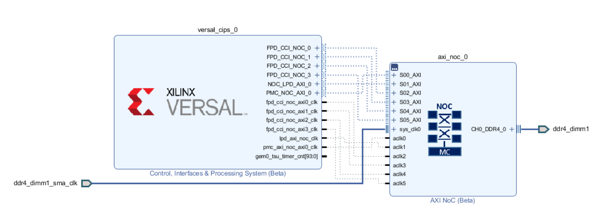
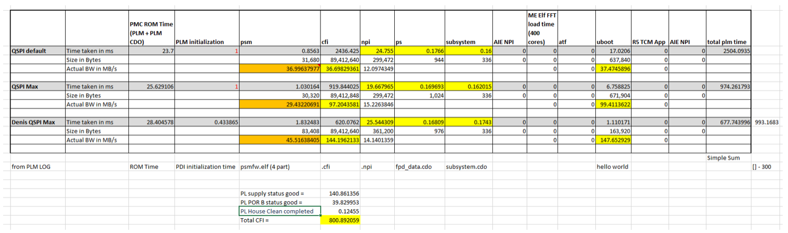
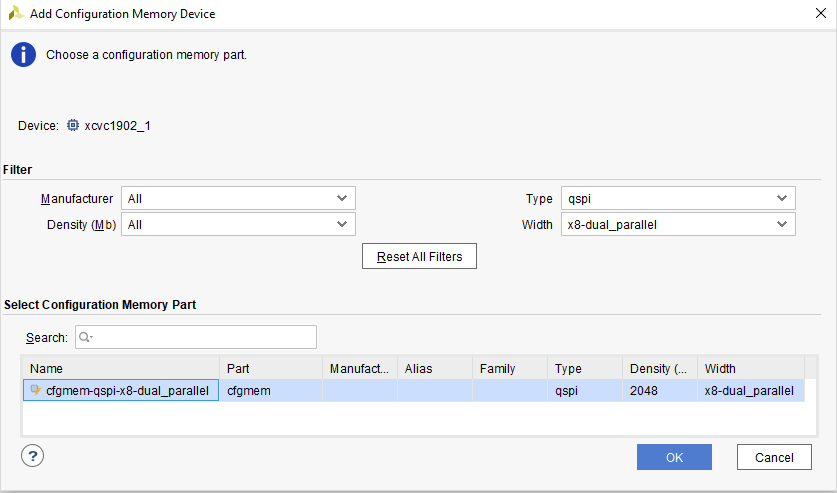
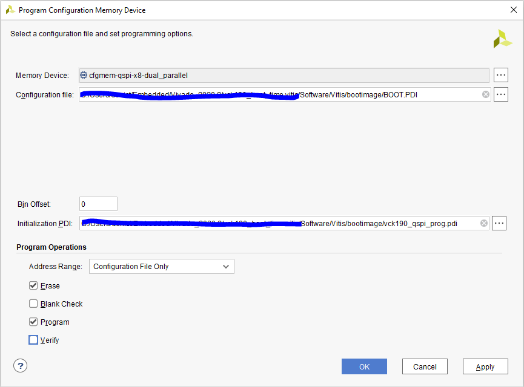

# Versal Example Design: Boot Time From Dual Parallel QSPI

## **Design Summary**

The goal is to be able to build a VCK190 design (QSPI dual Parallel) to reproduce the boot times outlined in the boot time estimator spreadsheet. What optimizations can provide the best Boot Time improvement for boot time critical designs?

---

## **Required Hardware and Tools**

2020.2 Vivado and Vitis

VCK190 Rev A.3 (ES1)

Boot Modules:
  - X-EBM-01 (Dual Parallel QSPI) Rev_A01

---

## **Project is NOT**

A full tutorial to meet boot time requirements for very specific designs.

---

## **Block Diagram**



---

## **Build Instructions**

### **Vivado:**

Be sure to source `settings.sh` for Vivado. 

If the board under test is not present in the Vivado installation, it can be installed following these steps.

Enter the `Scripts` directory. From the command line run the following:

`vivado -source vck190_board_install.tcl`

To create the project, run the following from the command line:

`vivado -source project_top.tcl`

The Vivado project will be built in the `Hardware` directory.

Once the project is created, click on "Generate Device Image".

Wait until "Device Image Generation successfully completed" then "Open Implemented Design".
Exporting the XSA to the Software folder with the following TCL command:
```
write_hw_platform -fixed -include_bit -force -file ../Software/vck190_wrapper.xsa
```

#### **NOTE**:
If the board under test is not present in the Vivado installation, it can be installed following these steps.

Be sure to source `settings.sh` for Vivado. 

Enter the `Scripts` directory. From the command line run the following:

`vivado -source vck190_board_install.tcl`

#### **NOTE**:

In order to better estimate the bandwidth while loading the CFI, the CFI compression has been removed using the following constraint:
```
set_property BITSTREAM.GENERAL.COMPRESS FALSE [current_design]
```
Doing so the PDI from Vivado is ~85.9 MB (Mainly CFI data).


### **Vitis**:

Be sure to source `settings.sh` for Vitis. 

Enter the `Scripts` directory. From the command line run the following:

`xsct -eval source vck190_vitis.tcl`

The Vivado project will be built in the `Software/Vitis` directory.

Launch the Vitis software platform and set the workspace path to `Software/Vitis`.

Apply the following modification to the project. Pre-modified files are present in the `Software/Vitis/src` folder.

#### **PLM MODIFICATION #1**:
In xloader_qspi.c (Software\Vitis\vck190_wrapper\psv_pmc_0\psv_pmc_0\bsp\psv_pmc_0\libsrc\xilloader_v1_2\src), change the QSPI prescaler to 2 (default was 8):
```
/*
* Set the pre-scaler for QSPI clock
*/
Status = XQspiPsu_SetClkPrescaler(&QspiPsuInstance, XQSPIPSU_CLK_PRESCALE_2);
```

#### **PLM MODIFICATION #2**:
In xplmi_config.h (Software\Vitis\vck190_wrapper\psv_pmc_0\psv_pmc_0\bsp\psv_pmc_0\libsrc\xilplmi_v1_2\src), define the following macros:
```
#define PLM_DEBUG
#define PLM_PRINT_PERF
#define PLM_PRINT_PERF_PL
```
in order to get the time break-down of the PL components.
```
[534.596184]PL supply status good
[574.426137]PL POR B status good
[574.550687]PL House Clean completed
```
Be sure to re-build the platform and all the applications after the changes are applied. 

#### **Generate a Boot Image (PDI)**:
Generate a Boot Image (PDI) using the following bootgen command and the output.bif already present in the `Software/bootimage` folder:
```
bootgen -arch versal -image output.bif -o BOOT.PDI -w
```
output.bif:
```
/*vck190_qspi*/
the_ROM_image:
{
	image 
	{
		{ type=bootimage, file= ../vck190_wrapper/hw/vck190_wrapper.pdi  } 
		{ type=bootloader, file= ../plm/Debug/plm.elf  } 
		{ core=psm, file= ../psmfw/Debug/psmfw.elf  } 
	}
	image
	{
		name=apu_subsystem
		id = 0x1c000000
		{ core=a72-0, exception_level=el-3, trustzone, file= ../hello_a72_0/Debug/hello_a72_0.elf } 
	}
}
```

## **Boot Time Estimation - Coming Soon.**
The Boot Time Estimator is a tool that Xilinx provides in order to estimate the time will take to boot a design on Versal from a specific boot device. It takes some input parameters from the user (like peripheral clocks and partition sizes) to closely match the specific design.




## **Running the Design**

#### **NOTE**:
We recommend to build a .pdi with compression,  name it `vck190_qspi_prog.pdi` and use it in the flash programming steps below to make it faster. 

Execute the following command on XSCT in order to program the BOOT.PDI file into QSPI flash. Xilinx strongly recommend to boot the Versal Device in JTAG boot mode (SW1 = 0000 (all ON)) to reliably program the QSPI.
```
xsct% program_flash -f BOOT.PDI -pdi vck190_qspi_prog.pdi -offset 0x0 -flash_type qspi-x8-dual_parallel
```
An alternative to program the QSPI flash is to use Vivado HW Manager.

#### **NOTE**: 

Xilinx strongly recommend to boot the Versal Device in JTAG boot mode (SW1 = 0000 (all ON)) to reliably program the QSPI.
Here two screen shots to help adding and programming a configuration memory device using Vivado HW Manager.

##### **Add a Configuration Memory Device in Vivado HW Manager**:



##### **Program a Configuration Memory Device in Vivado HW Manager**:




#### **Boot the Boot Image (PDI) from QSPI**:
There are two ways to test the design once the QSPI is programmed.

##### **Method #1**:
Change the Versal Device boot mode to QSPI32 (SW1 = 0100 (ON-OFF-ON-ON)) and power on the board.

##### **Method #2**: 
Change the Versal Device boot mode to JTAG (SW1 = 0000 (ON-N-ON-ON)), power on the board and run the following script:
```
tar -set -filter {name =~ "Versal *"}
# Enable ISO
mwr -force 0xf1120000 0xffbff
# Switch boot mode
mwr 0xf1260200 0x2100
mrd 0xf1260200
# Set MULTIBOOT address to 0
mwr -force 0xF1110004 0x0
# SYSMON_REF_CTRL is switched to NPI by user PDI so ensure its
# switched back
mwr -force 0xF1260138 0
mwr -force 0xF1260320 0x77
# Perform reset
tar -set -filter {name =~ "PMC"}
rst
```
This script change the boot mode from JTAG to QSPI without the need of power cycle the board.

#### **NOTE about ES1 Silicon**: 
On ES1 the boot time at power up is VERY different from the power up at SRST. At POR there's an extra 10 seconds added before CFI can be loaded (waiting for the System Controller to boot). The SRST is forced using the following script and still add an extra 300ms. Xilinx recommend to use Method #2 above to measure the boot time on ES1 Silicon.

#### **The PLM Log**:
To see the PLM Log the user can use the XSDB command "plm log" from target 1 (`tar -set -filter {name =~ "Versal *"}`):
Here a sample of the PLM Log:

```
[307.732281]PLM Initialization Time
[307.772028]***********Boot PDI Load: Started***********
[307.817787]Loading PDI from QSPI32
[307.856918]Monolithic/Master Device
[307.909209]FlashID=0x20 0xBB 0x21
[308.045428]0.210956 ms: PDI initialization time
[308.093134]+++++++Loading Image No: 0x1, Name: lpd, Id: 0x04210002
[308.146550]-------Loading Prtn No: 0x1
[308.535225]****************************************
[310.382762]Xilinx Versal Platform Loader and Manager
[315.272059]Release 2020.2   Dec  8 2020  -  12:53:00
[320.074268]Platform Version: v1.0 PMC: v1.0, PS: v1.0
[324.962118]BOOTMODE: 2, MULTIBOOT: 0x0
[328.540534]****************************************
[333.276621] 25.066875 ms for PrtnNum: 1, Size: 2224 Bytes
[338.490471]-------Loading Prtn No: 0x2
[342.619084] 0.532384 ms for PrtnNum: 2, Size: 48 Bytes
[347.047534]-------Loading Prtn No: 0x3
[351.046365] 0.401428 ms for PrtnNum: 3, Size: 57552 Bytes
[355.865384]-------Loading Prtn No: 0x4
[359.516106] 0.055737 ms for PrtnNum: 4, Size: 6032 Bytes
[364.596084]-------Loading Prtn No: 0x5
[368.206571] 0.015153 ms for PrtnNum: 5, Size: 80 Bytes
[378.580103]+++++++Loading Image No: 0x2, Name: pl_cfi, Id: 0x18700000
[384.844115]-------Loading Prtn No: 0x6
[537.615006]PL supply status good
[577.449009]PL POR B status good
[582.683790]PL House Clean completed
[1196.484734] 808.040415 ms for PrtnNum: 6, Size: 89412656 Bytes
[1199.378815]-------Loading Prtn No: 0x7
[1229.561496] 26.497965 ms for PrtnNum: 7, Size: 365712 Bytes
[1232.228284]+++++++Loading Image No: 0x3, Name: fpd, Id: 0x0420C003
[1238.303728]-------Loading Prtn No: 0x8
[1242.179221] 0.193259 ms for PrtnNum: 8, Size: 992 Bytes
[1247.331018]+++++++Loading Image No: 0x4, Name: apu_subsyste, Id: 0x1C000000
[1254.014128]-------Loading Prtn No: 0x9
[1258.814231] 1.113284 ms for PrtnNum: 9, Size: 163920 Bytes
[1263.153984]***********Boot PDI Load: Done*************
[1268.170415]27.423000 ms: ROM Time
[1271.384184]Total PLM Boot Time
```

## **Analyze the Boot Times**
This section helps the user understanding the break-down of the PDI loading process.
How to interpret the timestamps and calculate the bandwidth of the various sub-images.
Not always the QSPI bandwidth is the bottle-neck of the operation.

#### **PMC ROM Time**
27.423000 ms is the time the PMC ROM code takes to load the PLM into PPU RAM.
It does depend on the PLM size (in this case ~260KB).
```
[1263.153984]***********Boot PDI Load: Done*************
[1268.170415]27.423000 ms: ROM Time
```

#### **PLM Initialization Time**
0.210956 ms is the time the PLM takes to initialize the system.
For example clocking and MIO settings.
```
[308.045428]0.210956 ms: PDI initialization time
```

#### **LPD Loading and Configuration Time**
2224 bytes are loaded in 25.066875 ms.
Most of the time is used by the PLM to configure the LPD (PS).
Removing the PLM banner prints saves ~ 20 ms.

```
[308.093134]+++++++Loading Image No: 0x1, Name: lpd, Id: 0x04210002
[308.146550]-------Loading Prtn No: 0x1
[308.535225]****************************************
[310.382762]Xilinx Versal Platform Loader and Manager
[315.272059]Release 2020.2   Dec  8 2020  -  12:53:00
[320.074268]Platform Version: v1.0 PMC: v1.0, PS: v1.0
[324.962118]BOOTMODE: 2, MULTIBOOT: 0x0
[328.540534]****************************************
[333.276621] 25.066875 ms for PrtnNum: 1, Size: 2224 Bytes
```

#### **psmfw Loading and Initialization Time**
1.004702 ms (0.532384 + 0.401428 + 0.055737 + 0.015153) is the time it takes to load the pmufw and initialize the PSM.
The overall size of this image if 63,712 bytes (48 + 57552 + 6032 + 80) and the overall bandwidth is 62 MB/s.
This bandwidth is lower than the Dual Parallel QSPI theoretical bandwidth of 150 MB/s (when QSPI clock is 150MHz) due to the overhead time needed to initialize the PSM and start the psmfw code.

```
[338.490471]-------Loading Prtn No: 0x2
[342.619084] 0.532384 ms for PrtnNum: 2, Size: 48 Bytes
[347.047534]-------Loading Prtn No: 0x3
[351.046365] 0.401428 ms for PrtnNum: 3, Size: 57552 Bytes
[355.865384]-------Loading Prtn No: 0x4
[359.516106] 0.055737 ms for PrtnNum: 4, Size: 6032 Bytes
[364.596084]-------Loading Prtn No: 0x5
[368.206571] 0.015153 ms for PrtnNum: 5, Size: 80 Bytes
```

#### **cfi Loading Time**
808.040415 ms is the time it takes to power, initialize and program the Programmable Logic.
The size of the data in this case is 89412656 bytes which gives an overall bandwidth of 105 MB/s.
The overall process can be break down in few phases:
PL Supply Time = 537.615006 - 384.844115 = 153 ms (which depends on board design)
PL POR Time = 577.449009 - 537.615006 = 40 ms
PL House Clean = 582.683790 - 577.449009 = 5.23 ms
Loading from Dual Parallel QSPI time only =  1196.484734 - 582.683790 = 613.8001 ms
This shows the Dual PArallel QSPI bandwidht is 139 MB/s which is very close to the theoretical bandwidth of 150 MB/s.

```
[378.580103]+++++++Loading Image No: 0x2, Name: pl_cfi, Id: 0x18700000
[384.844115]-------Loading Prtn No: 0x6
[537.615006]PL supply status good
[577.449009]PL POR B status good
[582.683790]PL House Clean completed
[1196.484734] 808.040415 ms for PrtnNum: 6, Size: 89412656 Bytes
```

#### **npi Loading and Configuration Time**
Most of the 26.497965 ms are used by the PLM to configure the NPI.
The overall bandwidth of 13.4 MB/s is much lower than the Dual Parallel QSPI bandwidth.
In this case the size of the data is 365712 bytes.
See AM011 for max and/or typical NPI data sizes.

```
[1199.378815]-------Loading Prtn No: 0x7
[1229.561496] 26.497965 ms for PrtnNum: 7, Size: 365712 Bytes
```

#### **FPD Loading and Configuration Time**
Again, most of the 0.193259 ms are used by the PLM to configure the FPD (PS).
Since the size is 992 bytes, the overall bandwidth is 5.00 MB/s.
See AM011 for max and/or typical PS data sizes.

```
[1232.228284]+++++++Loading Image No: 0x3, Name: fpd, Id: 0x0420C003
[1238.303728]-------Loading Prtn No: 0x8
[1242.179221] 0.193259 ms for PrtnNum: 8, Size: 992 Bytes
```

#### **SW application Loading Time**
The software application is loaded in DDR and in this case the bottle-neck is the Dual Parallel QSPI.
The 163920 bytes are loaded in 1.113284 ms for a bandwidth of 140 MB/s (very close to the Dual Parallel QSPI theoretical bandwidth of 150 MB/s).

```
[1247.331018]+++++++Loading Image No: 0x4, Name: apu_subsyste, Id: 0x1C000000
[1254.014128]-------Loading Prtn No: 0x9
[1258.814231] 1.113284 ms for PrtnNum: 9, Size: 163920 Bytes
```

#### **Total PDI Time**
The overall PDI time (signaled by PS_DONE pin going high) is 1271.384184 - 300 = 971.384184 ms.
(There are extra 300ms on ES1 Silicon).
```
[1271.384184]Total PLM Boot Time
```

## **Conclusion**
The Boot Time Estimator Tool can be used to choose the appropriate boot device depending on the boot time requirements.
NOTE: Another important aspect to choose the proper boot device is the expected PDI size for a given design.
The time estimates can be verified once a board is available by looking at the plm log after booting from the actual boot device.

© Copyright [2020] Xilinx, Inc. All rights reserved.
