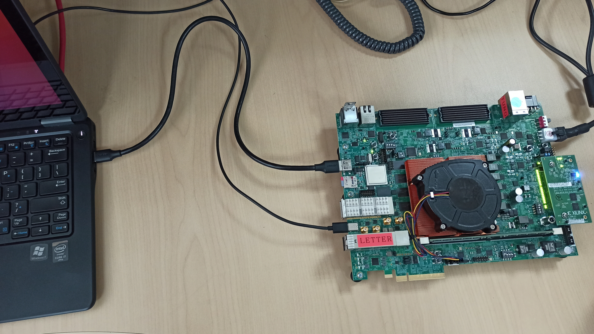
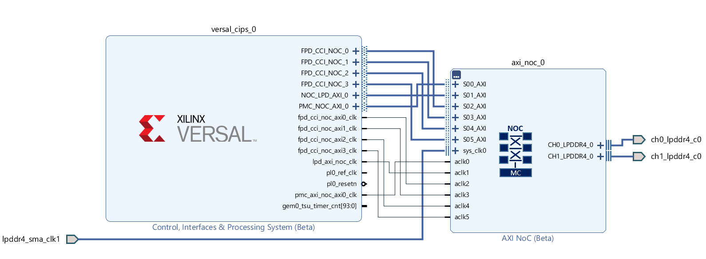

# Versal Example Design: USB as secondary boot device

## Design Summary
This example is going to demonstrate how to modify bif to load second PDI via USB in 2020.2.
VCK190 will be used for demonstration. We will use QSPI flash as first boot device to load PLM, and use USB as secondary boot device to load the other partitions(A72 helloworld applications or u-boot) 

## Applicable Platforms
- Platform: VCK190 ES1
- Tools: Vivado & Vitis & Petalinux 2020.2
- Board setup: Connect VCK190 J308 to PC host with USB cable; Set SW1 to 1000 as sd boot mode.


## Project is NOT
This project is NOT demonstrating how u-boot loads kernel from USB.

## Block Diagram


## **Build Instructions**
### Vivado Steps
Be sure to source `settings.sh` for Vivado.

If the board under test is not present in the Vivado installation, it can be installed following these steps.

Enter the `Scripts` directory. From the command line run the following:
```
vivado -source vck190_board_install.tcl
```

To create and build the project, run the following from the command line:
```
vivado -source create_vivado_project.tcl
```
The Vivado project `vck190_es1_lpddr4` will be created and built in the `Hardware` directory. 
A .xsa file will be generated in Vivado project directory.

### Vitis Steps

Be sure to source `settings.sh` for Vitis. 

Enter the `Scripts` directory. From the command line run the following:

`xsct -eval source vck190_lpddr4_vitis.tcl`

A Vitis workspace will be created and built in the `Software/Vitis` directory.

Launch the Vitis software platform and set the workspace path to `Software/Vitis`.

Copy `helloworld.c` file in the `Software/Vitis/src` folder to `Software/Vitis/hello_a72_0/src`, and then rebuild the project.

#### Note:
The modified `helloworld.c` is to add some delays before printing helloworld. This is because when A72 is printing helloworld, PLM may not release the control of UART, so helloworld may not be seen in the console. So in this example, 5 seconds delay is added before printing helloworld.

### Petalinux Steps
1. Be sure to source `settings.sh` for 2020.2 Petalinux. Enter `Scritps` directory.

2. Create a new Petalinux project based on release VCK190 BSP 
```
petalinux-create -t project -s <Directory-to-BSP>/xilinx-vck190-v2020.2-final.bsp -p ../Software/Petalinux/
```
3. Import the generated xsa file
```
cd ../Software/Petalinux/
petalinux-config --get-hw-description=../../Hardware/vck190_es1_lpddr4/ --silentconfig
```
4. Build Petalinux project
```
petalinux-build
```

#### Note:
VCK190 BSP can be downloaded in this link: 
https://www.xilinx.com/member/forms/download/xef.html?filename=xilinx-vck190-v2020.2-final.bsp

### Generate the primary boot image
- The primary boot image is used to boot plm from primary boot device, in this example, it is microSD card. The simplest method to generate the primary boot image is to modify the generated bif in vivado and then generate pdi again. User can look for the bif file that Vivado uses to generate PDI at <vivado project>/ <vivado project>.runs/impl_1/ *.bif, and then add "boot_device {usb}" to this bif, which would let PLM know that USB is the secondary boot device.
```
new_bif:
{
 ...
 id = xxx
 boot_device {usb}
 image
 {
  ...
 }
}
```  
 
- steps to generate primary boot image in this example (all bif files are located in `bif` directory)
 1. Copy a72_primary_2020_2.bif to Hardware/vck190_es1_lpddr4/vck190_es1_lpddr4.runs/impl_1/
 2. Copy plm.elf in `Software/Petalinux/xilinx-vck190-2020.2/images/linux/` to `Hardware/vck190_es1_lpddr4/vck190_es1_lpddr4.runs/impl_1/gen_files/`
 3. Open XSCT, and change working directory to `Hardware/vck190_es1_lpddr4/vck190_es1_lpddr4.runs/impl_1/`
 4. Run below command to generate primary boot image: boot_primary.bin
 ```sh
 bootgen -arch versal -image a72_primary.bif -w -o boot_primary.bin
 ```
#### Note: 
We have to use plm.elf instead of executable.elf in bif. Executable.elf is used by Vivado to generate PDI, but it don't support USB as secondary boot device. So need to use plm.elf which is generated in Vitis/Petalinux.

### Generate the secondary boot image for A72 helloworld
The second bif is used to generate pdi which contains helloworld appliation and is loaded via USB DFU.
1. Copy a72_secondary_helloworld.bif to `Software/Vitis/hello_a72_0/Debug/`
2. Change directory to `Software/Vitis/vck190_workspace/hello_a72_0/Debug/`
3. Open XSCT and generate secondary boot image for helloworld application by running below Bootgen command in XSCT:
```sh
bootgen -arch versal -image a72_secondary_helloworld.bif -w -o boot_secondary_helloworld.bin
```
### Generate the secondary boot image for u-boot 
1. Copy a72_secondary_u-boot.bif to `Software/Petalinux/xilinx-vck190-2020.2/images/linux/`
2. Change directory to `Software/Petalinux/xilinx-vck190-2020.2/images/linux/` 
3. Open XSCT and generate secondary boot image for helloworld application by running below Bootgen command in XSCT:
```sh
bootgen -arch versal -image a72_secondary_u-boot.bif -w -o boot_secondary_u-boot.bin
```
 
## Running the Design
1. Change the name of boot_primary.bin to boot.bin, then copy it to MicroSD card, and then boot up ACK190 with MicroSD.
2. PLM should wait for secondary image after printing below messages
```sh
[11833.689453]Loading PDI from USB
[11836.709006]Monolithic/Master Device
```
3. Loading secondary image by dfu-util in PC host
- If loading A72 helloworld application, copy boot_secondary_helloworld.bin to host and run below commands to download secondary image to VCK190
```sh
sudo dfu-util -l
sudo dfu-util -D boot_secondary_helloworld.bin
```
Helloworld prints should be seen in console. 
```sh
[5.742465]****************************************
[7.381787]Xilinx Versal Platform Loader and Manager
[12.001034]Release 2020.2   Jun 29 2021  -  10:15:45
[16.622028]Platform Version: v1.0 PMC: v1.0, PS: v1.0
[21.326884]BOOTMODE: 1, MULTIBOOT: 0x0
[24.748912]****************************************
[29.307037] 24.805350 ms for PrtnNum: 1, Size: 2224 Bytes
[34.333562]-------Loading Prtn No: 0x2
[38.315018] 0.542084 ms for PrtnNum: 2, Size: 48 Bytes
[42.546165]-------Loading Prtn No: 0x3
[47.542275] 1.552250 ms for PrtnNum: 3, Size: 57168 Bytes
[51.016237]-------Loading Prtn No: 0x4
[54.549650] 0.093968 ms for PrtnNum: 4, Size: 2512 Bytes
[59.400540]-------Loading Prtn No: 0x5
[62.958750] 0.118618 ms for PrtnNum: 5, Size: 3424 Bytes
[67.786450]-------Loading Prtn No: 0x6
[71.254037] 0.028700 ms for PrtnNum: 6, Size: 80 Bytes
[76.051703]+++++++Loading Image No: 0x2, Name: pl_cfi, Id: 0x18700000
[82.077106]-------Loading Prtn No: 0x7
[11973.559428]ERROR: PlHouseClean: Hard Block Scan Clear / MBIST FAILED
[12016.925743] 11931.400268 ms for PrtnNum: 7, Size: 707472 Bytes
[12019.850965]-------Loading Prtn No: 0x8
[12065.920353] 42.370971 ms for PrtnNum: 8, Size: 416464 Bytes
[12068.625743]+++++++Loading Image No: 0x3, Name: fpd, Id: 0x0420C003
[12074.662040]-------Loading Prtn No: 0x9
[12078.832834] 0.476340 ms for PrtnNum: 9, Size: 992 Bytes
[12083.569243]Loading PDI from USB
[12086.548118]Monolithic/Master Device
[19399.755084]7316.161415 ms: PDI initialization time
[19401.840178]+++++++Loading Image No: 0x0, Name: default_subs, Id: 0x1C000000
[19408.501306]-------Loading Prtn No: 0x0
[19412.240506] 0.044175 ms for PrtnNum: 0, Size: 163920 Bytes
[19417.638271]***********Boot PDI Load: Done*************
[19422.639171]26.470703 ms: ROM Time
[19425.874571]Total PLM Boot Time
Hello World
Successfully ran Hello World application
```
- If loading u-boot, copy boot_secondary_u-boot.bin to host and run below commands to download secondary image to VCK190
```sh
sudo dfu-util -l
sudo dfu-util -D boot_secondary_u-boot.bin
```
u-boot should be seen in console.
```sh
[5.741559]****************************************
[7.379621]Xilinx Versal Platform Loader and Manager
[11.995040]Release 2020.2   Jun 29 2021  -  10:15:45
[16.611381]Platform Version: v1.0 PMC: v1.0, PS: v1.0
[21.311996]BOOTMODE: 1, MULTIBOOT: 0x0
[24.730862]****************************************
[29.283503] 24.782378 ms for PrtnNum: 1, Size: 2224 Bytes
[34.305209]-------Loading Prtn No: 0x2
[38.284303] 0.541618 ms for PrtnNum: 2, Size: 48 Bytes
[42.512990]-------Loading Prtn No: 0x3
[47.503668] 1.550668 ms for PrtnNum: 3, Size: 57168 Bytes
[50.974834]-------Loading Prtn No: 0x4
[54.506225] 0.094106 ms for PrtnNum: 4, Size: 2512 Bytes
[59.354950]-------Loading Prtn No: 0x5
[62.910831] 0.118712 ms for PrtnNum: 5, Size: 3424 Bytes
[67.735503]-------Loading Prtn No: 0x6
[71.200018] 0.028709 ms for PrtnNum: 6, Size: 80 Bytes
[75.994590]+++++++Loading Image No: 0x2, Name: pl_cfi, Id: 0x18700000
[82.017453]-------Loading Prtn No: 0x7
[11999.025978]ERROR: PlHouseClean: Hard Block Scan Clear / MBIST FAILED
[12042.394381] 11956.930981 ms for PrtnNum: 7, Size: 707472 Bytes
[12045.319450]-------Loading Prtn No: 0x8
[12091.520568] 42.503400 ms for PrtnNum: 8, Size: 416464 Bytes
[12094.225590]+++++++Loading Image No: 0x3, Name: fpd, Id: 0x0420C003
[12100.260746]-------Loading Prtn No: 0x9
[12104.431596] 0.476534 ms for PrtnNum: 9, Size: 992 Bytes
[12109.168471]Loading PDI from USB
[12112.147290]Monolithic/Master Device
[104342.130056]92232.933509 ms: PDI initialization time
[104344.390687]+++++++Loading Image No: 0x0, Name: apu_subsyste, Id: 0x1C000000
[104351.143128]-------Loading Prtn No: 0x0
[104354.939759] 0.012656 ms for PrtnNum: 0, Size: 24912 Bytes
[104360.306534]-------Loading Prtn No: 0x1
[104364.110106] 0.019287 ms for PrtnNum: 1, Size: 59360 Bytes
[104369.471881]-------Loading Prtn No: 0x2
[104373.455278] 0.197537 ms for PrtnNum: 2, Size: 884128 Bytes
[104378.790753]***********Boot PDI Load: Done*************
[104383.877137]26.454871 ms: ROM Time
[104387.200737]Total PLM Boot Time
NOTICE:  ATF running on Xilinx Versal Silicon
WARNING: BL31: invalid exception level (3)
NOTICE:  BL31: Secure code at 0x0
NOTICE:  BL31: Non secure code at 0x8000000
NOTICE:  BL31: v2.2(debug):xilinx_rebase_v2.2_2020.1-10-ge6eea88b1
NOTICE:  BL31: Built : 10:13:47, Jun 29 2021
INFO:    GICv3 with legacy support detected. ARM GICv3 driver initialized in EL3
INFO:    BL31: Initializing runtime services
WARNING: BL31: cortex_a72: CPU workaround for 859971 was missing!
INFO:    BL31: cortex_a72: CPU workaround for cve_2017_5715 was applied
INFO:    BL31: cortex_a72: CPU workaround for cve_2018_3639 was applied
INFO:    BL31: Preparing for EL3 exit to normal world
INFO:    Entry point address = 0x8000000
INFO:    SPSR = 0x3c9


U-Boot 2020.01 (Jun 29 2021 - 10:15:39 +0000)

Model: Xilinx Versal vck190 Eval board revA (QSPI)
DRAM:  2 GiB
EL Level:       EL2
MMC:   sdhci@f1050000: 0
In:    serial@ff000000
Out:   serial@ff000000
Err:   serial@ff000000
Bootmode: QSPI_MODE_24
Net:
ZYNQ GEM: ff0c0000, mdio bus ff0c0000, phyaddr 1, interface rgmii-id

Warning: ethernet@ff0c0000 (eth0) using random MAC address - fa:23:0a:88:26:fa
eth0: ethernet@ff0c0000
ZYNQ GEM: ff0d0000, mdio bus ff0c0000, phyaddr 2, interface rgmii-id

Warning: ethernet@ff0d0000 (eth1) using random MAC address - a2:2e:d0:20:ff:d3
, eth1: ethernet@ff0d0000
Hit any key to stop autoboot:  0
Versal>
```
## Tips and Tricks
- About how to install DFU on Windows/Linux host, please refer to this wiki page: https://xilinx-wiki.atlassian.net/wiki/spaces/A/pages/18842468/ZynqMp+USB+Stadalone+Driver#ZynqMpUSBStadaloneDriver-USBDFUTesting
 
© Copyright [2021] Xilinx, Inc. All rights reserved.